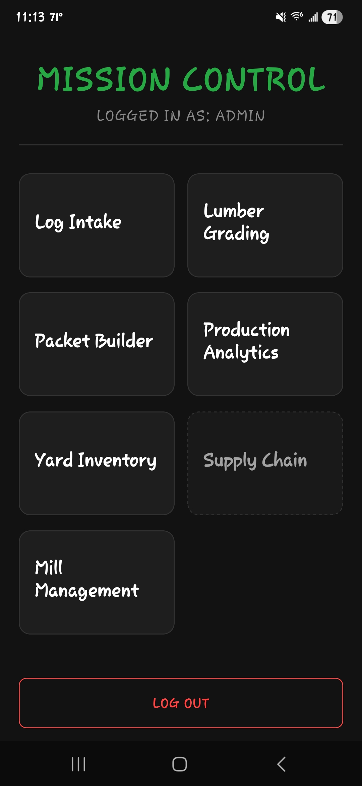
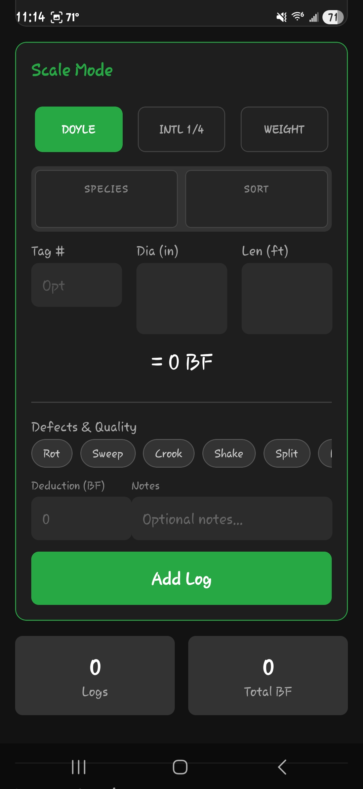
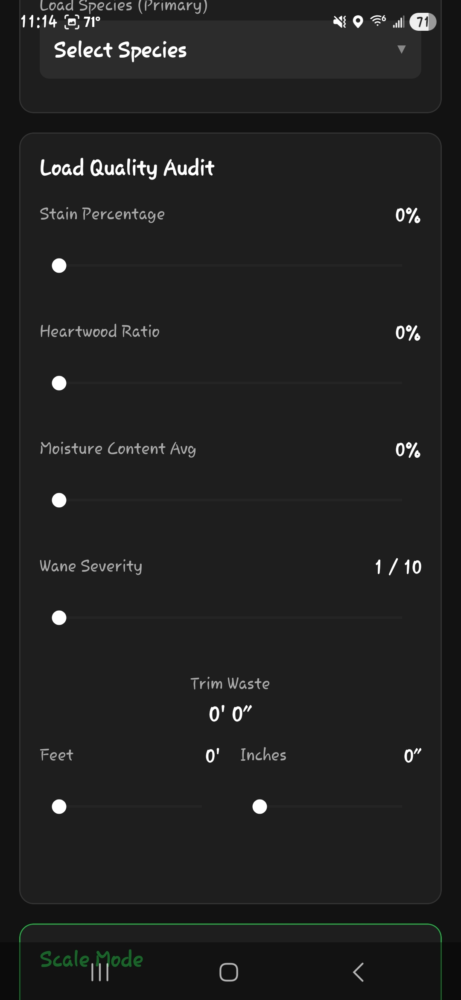
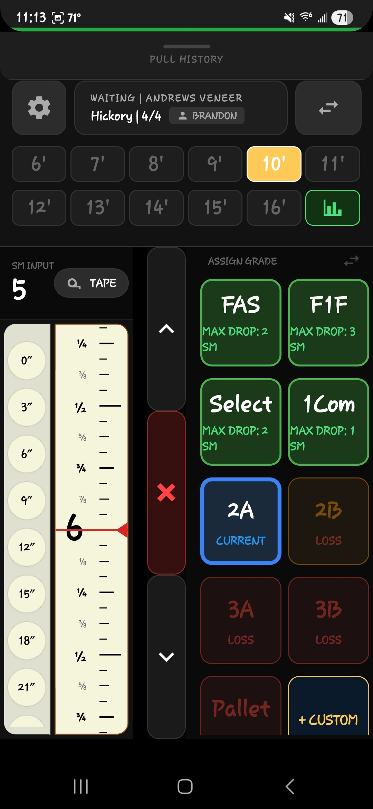
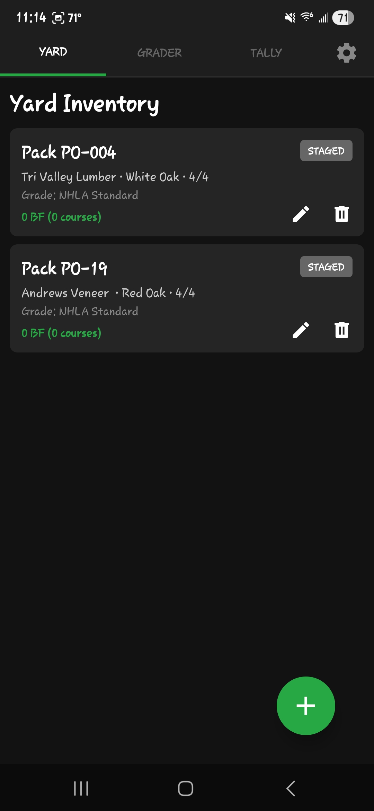
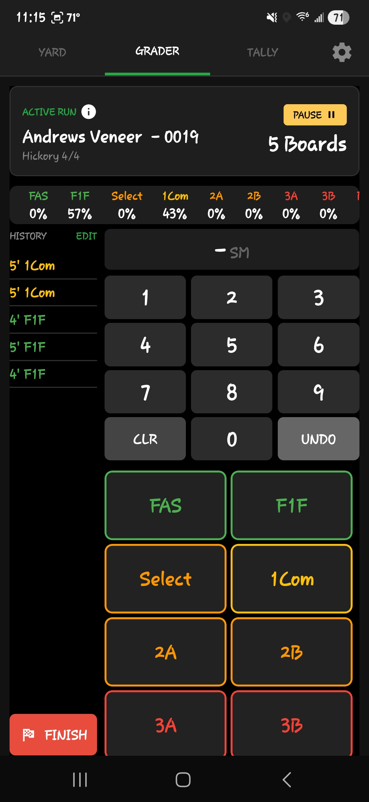
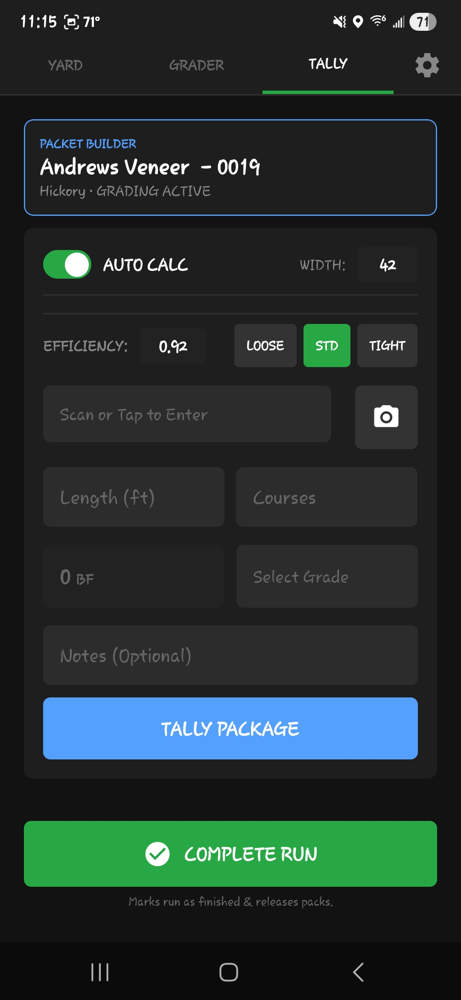
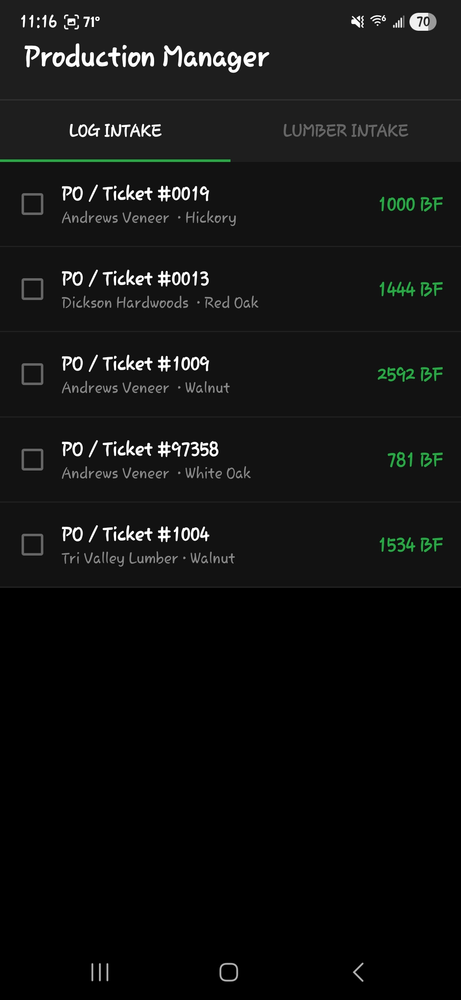
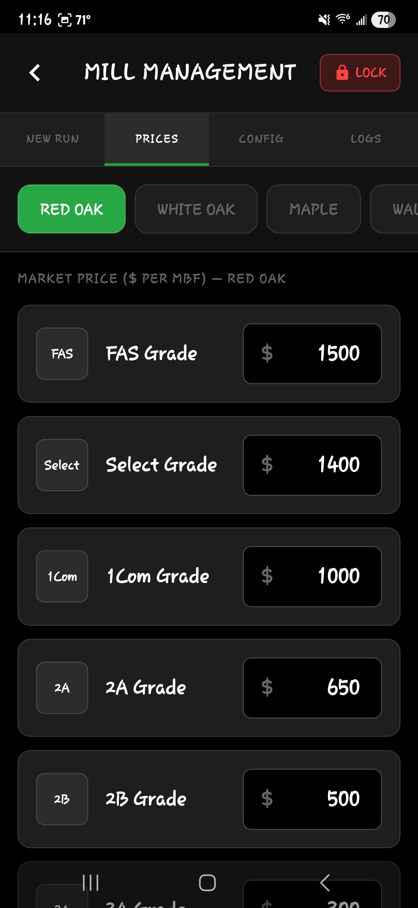
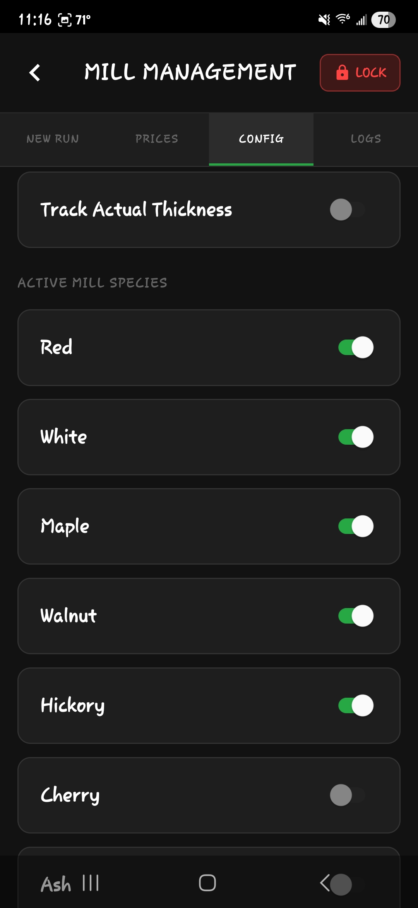

# EnvTory: Hardwood Lumber Grading & ERP Optimizer
**Bridging the gap between the sawmill floor and the front office.**
> **Note:** The source code for EnvTory is maintained in a private repository to protect proprietary business logic and enterprise security configurations. This repository serves as a technical showcase of the application's architecture, UI/UX design, and integrated manufacturing workflows.

EnvTory is an enterprise-grade, offline-first mobile application designed to optimize hardwood lumber grading, preserve manufacturing yield, and digitize the timber supply chain. 

Architected by a 15-year industry veteran and PSU Information Sciences student, EnvTory translates complex NHLA rules into a high-performance digital tool that protects mill profitability in real-time.

### 🎥 System Overview & Live Demo
[Insert Video Placeholder: Drag your compressed MP4 link here]

---

## 💡 System Modules & Core Features

### 1. Mission Control (The Hub)
The central command center. EnvTory is built on a modular architecture, allowing facilities to scale from simple intake to full-scale production analytics.

### 2. Log Intake (The Landing)
The entry point of the supply chain. This module handles vendor tickets, species identification, and granular defect audits (Stain, Heartwood, Wane).
* **Defect Logic:** Built-in deduction math for Rot, Sweep, and Crook.
* **Scale Mode:** Supports Doyle and International 1/4 rules.

### 3. Lumber Grading ("The Judge")
The heart of the app. Featuring a **Smart Tape** UI that mirrors the physical Lufkin sticks used by professionals.
* **Profitability Guardrails:** Real-time calculation of "Max Drop" and "Max Cut" allowed before a grade-upgrade loses money.

### 4. Packet Builder & Tally
Translating individual boards into commercial packages. This module manages the physical "Yard Inventory" while tracking the specific tally and grade distribution of every pack.
* **Auto-Calc:** Instant board-foot calculation based on width and efficiency settings.
* **Traceability:** Every pack is linked back to the original Log Yard ticket.

### 5. Production Manager & Analytics
The administrative layer for real-time visibility. Monitor current intake volumes and manage the mill's "Golden Rules" (Pricing, Species, and active production runs).

---

## ⚙️ Technical Stack & Architecture
* **Frontend:** React Native (Expo) & TypeScript.
* **Local Database:** OP-SQLite – For instantaneous "Edge" grading math.
* **Sync Engine:** PowerSync – True offline-first synchronization.
* **Backend:** Supabase – Secure Auth and cloud storage.
* **DevOps:** EAS – Native builds and OTA (Over-the-Air) updates.

---

## 📬 Contact & Collaboration
**Brandon Sickler** *B.S. Information Sciences and Technology | Pennsylvania State University* * **LinkedIn:** [www.linkedin.com/in/brandonsickler](https://www.linkedin.com/in/brandonsickler)
* **Email:** BrandonMSickler@gmail.com

---

  Built for the Lumber Industry. Powered by Penn State IST. 🌲

